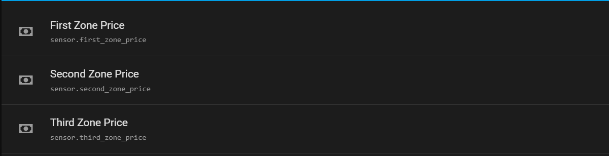

# Yasno Home Assistant Integration

Integrate your Yasno energy account with [Home Assistant](https://www.home-assistant.io/) to monitor electricity usage, balance, and more—right from your smart home dashboard.

---

## Features

- 🔌 **Real-time data**: View actual data.
- 📊 **Historical stats**: Track usage trends over time.
- ⚡ **Multiple accounts**: Support for multiple zones.
- 🛠️ **Easy setup**: Simple configuration via Home Assistant UI and Energy tab.

---

## Installation

1. **Download** or clone this repository:
    ```bash
    git clone https://github.com/yourusername/yasno-homeassistant-integration.git
    ```
2. **Copy** the integration folder to your Home Assistant `/config` directory.
3. **Add** existing line to your `configuration.yaml` file.
    ```yaml
    # ...
    command_line: !include_dir_merge_list yasno-homeassistant-integration/sensors
    ```
4. **Restart** Home Assistant.
5. **Find** The sensors in entity tab


---

## Usage

- Access Yasno sensors in Home Assistant.
- Create automations based on your energy data.

---

## License

This project is licensed under the MIT License.

---

**Made with ❤️ for Home Assistant users in Ukraine.**

